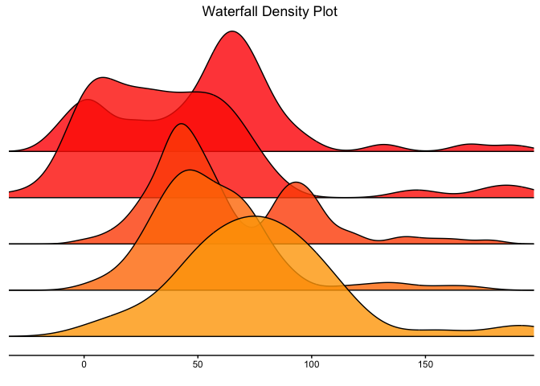
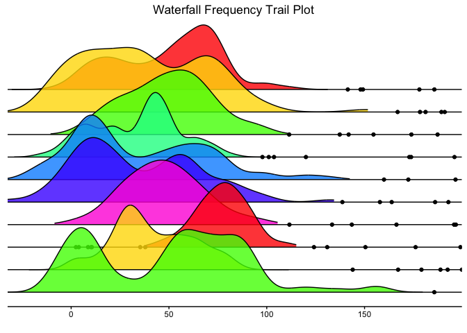
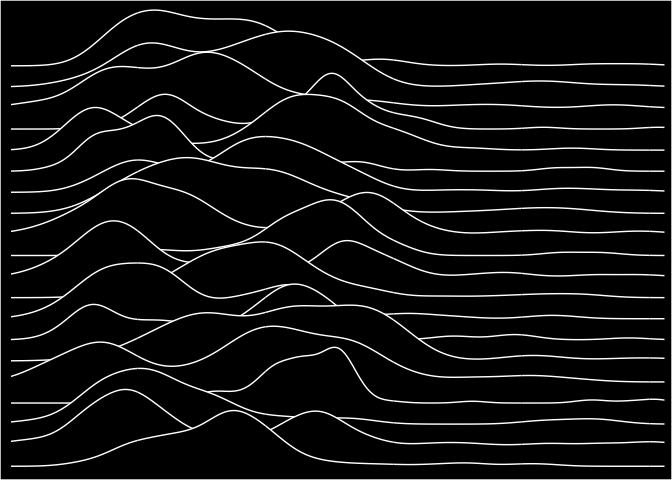
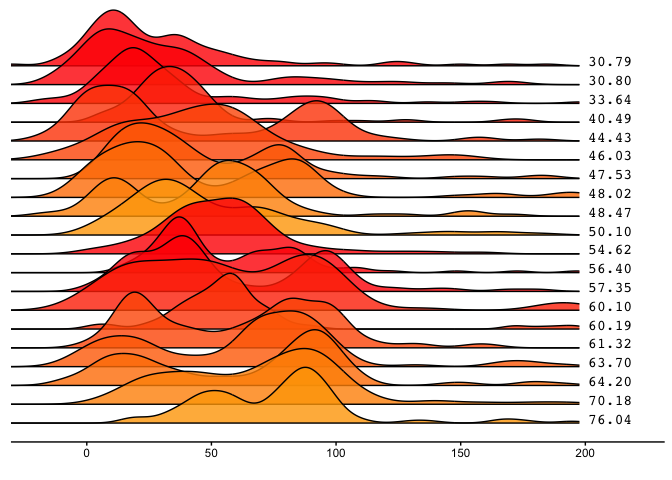

<!-- README.md is generated from README.Rmd. Please edit that file -->

# ggwaterfall

<!-- badges: start -->

<!-- badges: end -->

`ggwaterfall` provides functions for drawing waterfall plots. Includes
[density](https://en.wikipedia.org/wiki/Density_estimation) and
[frequency
trails](http://www.brendangregg.com/FrequencyTrails/intro.html)
waterfall plots.

## Installation

You can install the latest version of ggwaterfall from GitHub with:

``` r
install.packages("devtools")
library(devtools)
install_github("AndreyAkinshin/ggwaterfall")
```

## Example

Here are some `ggwaterfall` usage examples:

``` r
library(ggwaterfall)
waterfall_density(rdistrs(5), title = "Waterfall Density Plot")
```



``` r
waterfall_ft(rdistrs(10), rainbow(7), title = "Waterfall Frequency Trail Plot")
```



``` r
waterfall_density(rdistrs(20), style.pulsar = TRUE)
```



``` r
waterfall_density(rdistrs(20), metric = "mean", sort.value = "metric",
                  show.labels = TRUE)
```


